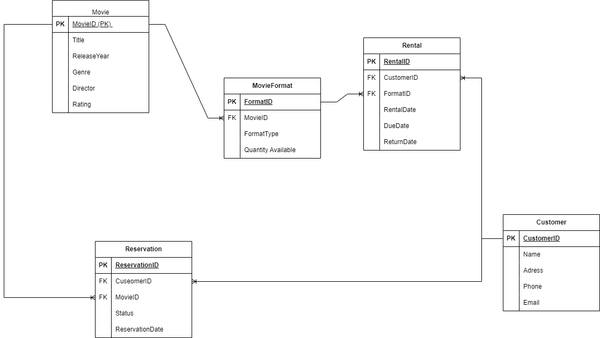

# RentalFlix ERD

## Overview
The RentalFlix ERD (Entity-Relationship Diagram) is designed to efficiently manage the movie rental service, capturing the key entities and relationships necessary to track movies, customers, rentals, and reservations.

## ERD Diagram

## Entities and Relationships

### 1. Movie
The `Movie` table stores information about movies available for rent.
- **MovieID** (PK): Unique identifier for each movie.
- **Title**: Title of the movie.
- **Genre**: Genre or category of the movie.
- **Director**: Director of the movie.
- **ReleaseYear**: The year the movie was released.
- **Rating**: Movie rating (e.g., PG, PG-13, R).

### 2. MovieFormat
The `MovieFormat` table stores information about the different formats of each movie.
- **FormatID** (PK): Unique identifier for each movie format.
- **MovieID** (FK): Identifier of the movie.
- **FormatType**: Type of format (e.g., DVD, Blu-ray, Digital).
- **QuantityAvailable**: Number of copies available for rent.

### 3. Customer
The `Customer` table stores information about customers.
- **CustomerID** (PK): Unique identifier for each customer.
- **Name**: Name of the customer.
- **Address**: Address of the customer.
- **Phone**: Contact phone number.
- **Email**: Contact email address.

### 4. Rental
The `Rental` table tracks which customers have rented which movie formats and when.
- **RentalID** (PK): Unique identifier for each rental record.
- **CustomerID** (FK): ID of the customer who rented the movie.
- **FormatID** (FK): ID of the movie format that was rented.
- **RentalDate**: Date when the movie was rented.
- **DueDate**: The date when the movie is due to be returned.
- **ReturnDate**: Date when the movie was returned (nullable).

### 5. Reservation
The `Reservation` table tracks which customers have reserved which movies and the status of these reservations.
- **ReservationID** (PK): Unique identifier for each reservation.
- **CustomerID** (FK): ID of the customer who reserved the movie.
- **MovieID** (FK): ID of the reserved movie.
- **ReservationDate**: Date when the reservation was made.
- **Status**: Status of the reservation (active, fulfilled, canceled).

## Relationships
- **Movie to MovieFormat**: One-to-Many (One movie can have multiple formats)
- **Customer to Rental**: One-to-Many (One customer can have multiple rentals)
- **Rental to Customer**: Many-to-One (Many rentals can be associated with one customer)
- **Rental to MovieFormat**: Many-to-One (Many rentals can be associated with one movie format)
- **Movie to Reservation**: One-to-Many (One movie can have multiple reservations)
- **Reservation to Customer**: Many-to-One (Many reservations can be associated with one customer)
- **Reservation to Movie**: Many-to-One (Many reservations can be associated with one movie)
